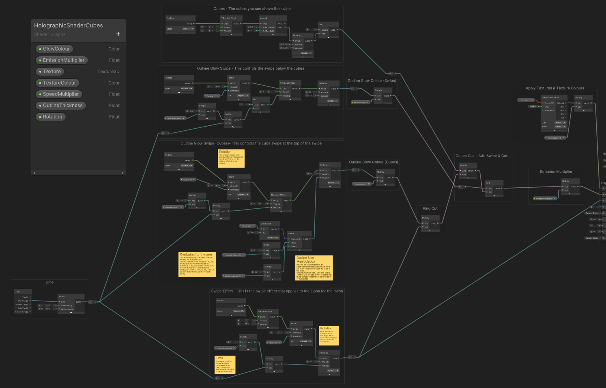

# FreeJam VFX Test
A test for FreeJam for the Junior VFX role


## Table of Contents
1. [Additional Information](#additional-information)
2. [Project Documentation](#project-documentation)
    * [Planning Stage](#planning-stage)

    * [Creating the Shader](#creating-the-shader)
        
    * [Creating the Particle FX](#creating-the-particle-fx)

    * [Developing and Presenting the Project](#developing-and-presenting-the-project)

    * [How I Would Improve, Change and Optimize The Current Visual FX](#how-i-would-improve-change-and-optimize-the-current-visual-fx)
        
    * [A Different Approach: Cookie Cutout](#a-different-approach-cookie-cutout)
                        
4. [Getting Started](#getting-started)
    * [Prerequisites](#prerequisites)
    * [Installing](#installing)
5. [Built With](#built-with)

---

## Additional Information
Thank you very much for letting me take this VFX test!
In this documentation, you can read about the process I've taken for the test. 
I've done a few extra things for the test, like the [Planning Stage](#planning-stage), [How I Would Improve, Change and Optimize The Current Visual FX](#how-i-would-improve-change-and-optimize-the-current-visual-fx) and [A Different Approach: Cookie Cutout](#a-different-approach-cookie-cutout) - so if you just want to read about the VFX stuff, that is under [Creating the Shader](#creating-the-shader), [Creating the Particle FX](#creating-the-particle-fx) and [Developing and Presenting the Project](#developing-and-presenting-the-project)!
 
---

## Project Documentation

### Planning Stage
To start the project, I needed to plan out how I was going to approach this test, I had a visual effect video as my first point of reference, but I needed to take a deeper look into this video and really try to *break down* what I'm making, and this is where concept art, and quick sketches come in handy!

#### Initial Planning

From just watching the video I was able to break down the main parts of the shader and particles easily! I broke this down at a high level to begin with, so my initial concept art was more of an overview of how I wanted to approach the shader for the swiping effect, with a brief look into the details of the edge glow, and into the particles, but that was all it was, a brief look, and doing this made me realise the swiping of the shader, without the edge glow is a good place to begin with the shader! It didn't take me long to sketch this out, it was just how I envisioned the result of the swiping to look, and whilst I was doing this, I had the idea to also draw in this concept the shader being able to swipe from *any* angle, not just 90 degrees, 180 degrees, etc… - Just as a note for myself to look into later!

#### Planning Throughout Production
All the planning done after the initial planning was done during the production, after I noticed extra finer details like how the particle cubes weren’t 3d (or were they? I could never tell!), how the particles hover from top to bottom and how the shader would glow, this is all stuff which I noticed as I worked on different areas of the VFX, as my initial planning was more of a very high-level overlook of the effect.

##### Outline Glow Planning

I planned this out as I was working on the outline glow on the shader, but I didn't feel custom enough! So I sketched out the top three designs to give me an idea of what I wanted to do, and the bottom two were ideas I thought looked cool!

##### Particles Planning

When I made this, I was at a point where I felt ready to add the particles, but it was a new day, and I hadn’t watched the VFX video for a day as I didn’t have access to the example video, so I thought it might be a good, and creative time to draw up what I remember from the particles in the video and add some of my own ideas to it! This is what I drew from my memory! – And this is also, just a concept of the particles, without the glow around the edge of the shader so I can focus on just the particles for now.
Once I was able to watch the video again, I compared the concept planning to the actual VFX video, and I was close!
From this, I will be making the small cubes around the edge 2d, as they are in the video, but it’s hard to see, also in the example video, the 3D cubes are a lot smaller, and I still can't tell from the video whether they're 2D or 3D! I'm leaning more towards 3D though as it makes the most sense!
Watching the video again, and looking really close at the glowing edge, it made me realise that the smaller cubes weren't a particle, and were actually part of the shader! I wouldn't have noticed them at all without looking closer either!

##### Particle Flow and Silhouette Planning

Due to the very particular moving pattern during the particles lifetime, I decided another good thing to doodle quickly would be how I envision the pattern of the particles over their lifetime, as well as the overall silhouette so the VFX looks balanced.
One of the main things I noticed is the pattern which the particles are taking, its hard to describe in words, but I can see the particles in the example travelling up the mesh, spawning subtly outwards and wiggling around, some going inwards, with a noise pattern applied.

##### Different Approaches & Optimizations Demonstration

Once I had finished the VFX, I was thinking of how I could improve and optimize it, as well as other approaches I could take, and I talk about this in more detail in the `How I Would Improve and Optimize The Current Visual FX` section, and the `Different Approach Cookie Cutout` section of this document, but you can see the rough ideas here!

#### Analysis
Overall, I think making sketches like this helps me out a lot with planning out creative projects, whether that be 3D, UI or VFX, and it doesn't take me long either!
If I hadn't been planning out the different parts of the VFX, I wouldn't have noticed the things like the small cubes on the shader, or the pattern of travel that the particles take.
Although, I do wish I thought of the different approaches I could take before I picked the first one which came to mind, as I think it would've been good to think about that earlier, and in a professional environment, I could talk to my coworkers about what they would prefer, as they could be using it one day as well!

### Creating The Shader
The shader includes the swiping alpha, the glow effect, and the small cubes around the edge.

#### Swipe Shader

For the shader, I had to figure out how I can make the alpha of the material ‘swipe’ across the model, I wasn’t worried about the glow for now, just the swipe effect with transparency.
So, I began by making a HDRP Lit Shader Graph, and to make sure the material was using alpha to get the swipe working, I had to enable ‘Alpha Clipping’ in the graph inspector and set it to 1 on the shader graph.
With this now set up, I began working on the swipe, using the ‘Rectangle’ node to help me make a mask for the alpha. I then manipulated the position of this rectangle using tiling and offset and the position node, initially setting the position space to ‘object’.
Now to make the rectangle move and scale how I wanted it to, I was going to play with the height, and because I’ve adjusted the UV of the rectangle, scaling the height looks like a swipe motion.
To move the height, I used the time node, and I multiplied the sine time by a value which I will replace with an exposed integer when I get to clean up.
Doing this resulted in the swiping up and down effect which I wanted!

#### Glow Shader

To add the glow on the outline of the swipe, I done something a little like the initial swipe.
Similar to the initial wipe, I used the rectangle node, which had tiling and offset passed through the UVs as well as position, which was also on space mode ‘object’
For this, the rectangles height was set to a value, instead of passed through time like the initial wipe, doing this allowed me to make the rectangle line thinner, and then I instead passed multiply and time into the tiling and offset ‘offset’ pin for the glow outline.
For the appearance of the outline, I used a multiply node, and multiplied the rectangle by colour, so this would allow me to set any colour for the glow line. And then, I multiplied this again by the rectangle of the initial swipe, which cut off any extra parts of the glowing outline which I didn’t need which just left us with a line for the outline, and then this was passed into the emission node.

#### Adding In The Edge Cubes

Like mentioned in the planning art, it wasn’t until later that I realised there was little cubes on the shader itself, so this was added once the basic swipe and edge glow shader was done.
It wasn’t too hard to do this, as I broke down a basic plan: I had to make a new outline and slightly offset it on the shader, so I could use the original edge outline shader for the cube pattern, so it would look like the cubes were coming off of the bottom outline.
So, I played around with noise shaders for a bit, until I got a cube pattern that I liked, and then I had to figure out how to plug that into the edge outline, and after some playing around with the nodes, all I had to do was plug the pattern of the cubes into the edge outline using a multiply node, and then that would cut the cubes out from the edge outline, and then I used the add node to add the offset outline and cubes outline together.

#### Rotation On The Shader
I wanted to be able to use this shader from any angle. I can currently rotate the swipe part of the shader at any angle, but because of how I made the cube edges and the outline, it gets harder to swipe those well from a good angle, and it's mainly because for the outline and cube edges, I use the height parameter to move the cubes and outline along with the swipe.
I managed to figure out how to get a perfect up and down swipe, as well as a 90 degree swipe for now, by using [magic numbers](https://en.wikipedia.org/wiki/Magic_number_(programming)), but it's not the best solution at all, it's not logical, and it's generally a mess, if I were to approach this again, I would think about the rotation much sooner.

#### Cleaning Up The Shader

I added parameters on areas which I think the user should be able to customize, colours, textures, thickness of lines, speeds of swipes and rotations, amongst a few.
And to make the shader easier for another person to understand, I added sticky notes, and documented the shader, much like I would document code!

#### Issues and How They Were Resolved
Once I had finished with the above, it all looked great in the main preview, and in the scene view! But I had one major issue - It didn’t look right in the game view!
The swipe was working with the transparency, but I couldn’t see the emission, so I originally thought that maybe I didn’t have post processing turned on on the camera, but it didn’t end up being that it was just because my emission wasn’t high enough! 
I went back into the slice shader graph and applied another multiplier to the outline which multiplied the emission and plugged that into the emission plug on the node, and then turned up the colour’s HDR intensity, and then everything looked alright!

Another issue which I had is when I had the shader on both the sphere and the car, it wasn’t slicing equally, by that I mean it was fading the entire sphere, but only half of the car, and this would also be an issue for the separate parts of the car too, but this was something I immedietly knew how to fix, and all I had to do was set the position node to be in ‘Absolute World’ space for both the outline and the swipe.

I had some small issues with getting the normal rotation to work with the edge cubes and the outline, but in the end it was because the tiling and offset were different for both of them, so I just had to separate them.

The cubes looked a bit distorted when I began to play around with the noise, but a fix for that was to make the Voronoi node have a very small angle offset, but I couldn’t use 0, this felt quite hacky if I’m being honest, but it works.
The cubes also looked distorted because of their position space as it was set to ‘absolute world’ like everything else in the shader, and to fix that I set just the space to be ‘view’ for just the cubes.

#### Analysis
I really enjoyed making this shader, and I'm proud of the result, but there are a few things I would like to change about this!

I think it would look a lot nicer if the cubes cut out the alpha instead of just overlay. It’s hard to tell it’s not doing this in the game though.
This could be done if I passed the cubes through as alpha, but to do that properly I would need to cut the cubes out from a ring, similar to how I do the outline, and then cut them out of the alpha.

### Creating The Particle FX

#### Creation Process
I didn't end up documenting too much of the particle creation process, due to it just being alot of tweaking values to get the right effects.

The main things I wanted to get right were:
* The glow on the particles 

I achieved this by attaching a material to the particles which had the same glow as the shader.

* The particles coming from the bottom to the top, following the swipe of the holographic effect, as if it's filling in all of the mesh with the cubes. 

I achieved this by making a specific particle shader, which swiped from the bottom to the top, just like the other shaders. It's not the best way to do this, as if you look very closely, you can see some particles get cut off, but I reduced how much of this which was visible by making the particles shrink over time.
If I were to reapproach the project, this would be something I consider, as I was originally planning to animate the particles to follow the swipe, but because of how I'm handling the swipe, I'm unable to do that. I did attempt to animate the particles alongside the shader, but it didn't look right due to not getting the timing to sync up with the shaders' sine time.

* The specific movement of the particles

To get this right, I had alot of fun playing around with the noise parameter in the particles setting.

* The particles spawning from the mesh of the object

I made sure the particles spawned from the mesh of the car, and this looked really cool!

#### Analysis
The particles were great fun to put in alongside the shader, and I really like how it tied everything together, I could futher optimize this by making the 3D particles a 2D billboard, and it won't look too different.

### Developing and Presenting The Project

#### The Visual FX Controller

This was something which I really wanted to put into the project, I wanted some sort of controller for the VFX, where values could be tweaked, and it would be reflected during runtime in the game, this is so I can also put in buttons on the game to adjust the material properties.

##### Mesh Renderers, Particle Material and Shader Material Instances Paramater
These parameters are for **getting** materials which you want to adjust the properties for.
The **Mesh Renderers** parameter is for any models with multiple textures and materials, in this case, I populated it with the cars mesh renderers, so when the game begins, the **Shader Material Instances** parameter populates with instances of the materials for the car.
The **Particle Material** parameter is for the material which is on the particles.

##### Rotation Data & Rotation
Due to the rotation using [*magic numbers*](https://en.wikipedia.org/wiki/Magic_number_(programming)), I had to have specific numbers in the shader parameters to get it to work right, so instead of having the user confused and trying to get this to work right, I made a ScriptableObject called **VFXRotationProperties**, and this would include a float for the OutlineThickness and the Rotation in Degrees, so I made 2 of these data objects for 0 degrees and 90 degrees, and this was put into the Rotation Data array, this also helps so whenever I need to set the rotation in the code, I'm not using [magic numbers](https://en.wikipedia.org/wiki/Magic_number_(programming)) inside of the code, which would just make things confusing to read.
The Rotation parameter is just an enum of the different rotations which the player can pick between.
If I were to approach this again, I would like rotation to be on a slider with a range 0 to 90, so the player can pick any angle for the rotation of the VFX.

##### Shader, Particle Colours and Particle Rate
These are pretty self-explainatory, but the colour parameters set the Shader and Particle colours, you could have these two completely different colours, or the same, the choice is up to the user!
The particle rate controls the number of particles, and the default value is 500, as I think that looks best!

#### Runtime Editor

As I wanted to have some way for the user to play with the values of the shaders and particles in-game, I put together a Runtime Editor for the VFX, including camera settings and VFX settings, as well as a setting to change objects to see what the shader looks like on other things.
If I had more time, I would make the UI look nice, but you're able to toggle it on and off anyway!

#### Project Management and Use of Source Control
I decided it might a good idea to use source control for this project, so I could make use of all the different tools it offers, it also helps show my workflow and how I approach this test in a bit more detail.
To break down my tasks so I'm not working on multiple things at the same time, I use the 'Issues' part of the Git Repository, and make myself tickets for each specific thing I need to do for this test, it also allows me to comment on the ticket with things that I want to change, or just make notes. You can see all of the tickets by looking at the `Closed` tickets.
Using source control also allows me to work in seperate branches for each task, and it also means I have backups incase things go wrong.

Outside of repositories, I took lots of smaller notes on paper of things I wanted on this project, and I made sure I had my concept planning drawings close by as well as the video.

### How I Would Improve, Change and Optimize The Current Visual FX

#### Shader Improvements and Changes
For the shader, I would improve on the **rotation** and change the **time** aspect.
Like mentioned above, to improve the rotation, I wouldn't be using so many magic numbers, I want it easy for the user to pick any angle, and to achieve what I wanted I would need to recreate the shader keeping the rotation in mind.
For the time, I would get rid of the entire `Time` aspect, and instead make the shader change from a float, this way I could either program, or animate the shader parameter moving by changing the float, and being allowed to animate the shader means I can combine that with the particle effects and get something which fits together better, it would also mean I could animate the particles position according to the shaders position float instead of using the alpha swipe cut on the particles.

#### Particle Improvements and Optimization
There isn't much which I would change about the particles. 
I don't like currently how the particles don't fully disappear when they reach the top of the car, I did try and make this happen by changing the size over lifetime in a specific way, and it would work, but get out of sync quickly, so this wasn't a good soution in the end, and it would be fixed with the time solution proposed above.

### A Different Approach: Cookie Cutout

<sup><i>The cookie cutter approach is the top concept, the bottom left concept can be used for other things but not documented.</i></sup>

#### Shader Ideas For Cookie Cutout
For the shader for the cookie cutout I would do the following things:
1. Have the same shader I currently have, but instead move the swipe on a float parameter instead of the time node.
2. Apply the material shader to the model.
3. Make a cube which will act as the `cut out`
4. Add a script onto `cut out cube/mesh` which grabs the materials/model/tags for whatever items which needs to be spawned/despawned, and depending on the location of the cut out cube relative to the item being effected, it adjusts the amount cut out from the shader, this could be expensive if done on an update function as it would always be checking for collision, so to optimize this, there are a few different ways:
      * The shader could be cut out at a particular time, like when a specific function is called, so it's not checking when it doesn't need to.
      * Another approach which I think is alot better is if the cube touches either the top or the bottom of the mesh, it would spawn/despawn depending on where it touches and it could be cut out using a lerp instead of the actual cut out cube, and this could be calculated by getting the midpoint location of the mesh and calculating whether the cube is above or below that, or the cube could always be in the middle of the mesh, and if it moves up or down, it either spawns or despawns, and then snaps back into the middle so the user can do that again once the animation has finished playing.
      * The same could be done just by calling a function in a script without even using a cube if we have access to the swipe float parameter on the shader.
           * I would personally use a package in the Unity Asset Store called [DOTween](https://assetstore.unity.com/packages/tools/animation/dotween-hotween-v2-27676) to control how the shader swipes as it's got a whole library of really nice tweens to use!

#### Particle Ideas For Cookie Cutout
If I have access to the swipe float parameter, I would use the Unity Animator to animate whether the particle is active or not and where the particles are, I feel this would give so much more impact to the feel of the VFX as I would be able to play around with timing of the whole effect alot more.

---

## Getting Started

### Prerequisites
[](https://unity3d.com/get-unity/download/archive)

### Installing
Here is how you can get the test running for development and testing purposes:
```
1. Download the project 
2. Launch Unity Hub
3. Press 'Add' on the top right corner of the hub
4. Navigate to the directory where the project was downloaded
5. Open with the specified Unity version
```

## Built With
* [Unity](https://unity3d.com/get-unity/download/archive) - This is the Game Engine used
   * [Arcade Racing Cars](https://assetstore.unity.com/packages/3d/vehicles/arcade-racing-cars-pickup-jeep-153218) - This is the 3D asset I used to present the shader
   * [High Definition Render Pipeline](https://unity.com/srp/High-Definition-Render-Pipeline)
   * [HDRP Shader Graphs](https://unity.com/features/shader-graph)
* [Visual Studio 2019](https://visualstudio.microsoft.com/) - This is the IDE I used
